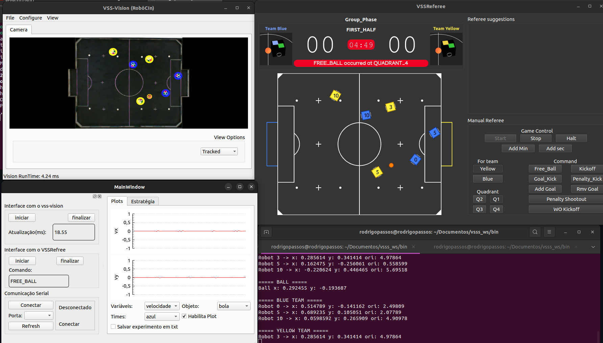

# LambeSujo Client
Interface para utilização do Sistema de visão da RoboCIn. Possui comunicação via IP com o VSSSReferee (Necessário para o reposicionamento automático), e uma parte para a comunicação serial (Para enviar comandos de velocidade para os robôs)

# Criando um repositório

Sistema de visão do lambe sujo

(Abra o terminal)

1 - Selecione um diretório

2 - git clone https://github.com/rodrigopassoss/LambeSujo_Client.git
3 - cd LambeSujo_Client

Pronto, agora você tem o repositório em seu computador.

Sempre que for mexer no código, verificar se há novas alterações pra trabalhar na versão mais recente e criar novo galho.

1 - git checkout master

2 - git pull origin master (check updates)

# Criar novo galho para edição (Para Contribuir)
1 - git checkout -b novoGalho

 Após fazer mudanças, você deve salvá-las e refazer o upload dos arquivos.

1 - git add

    a) git add [Arquivo 1] [Arquivo 2] [Arquivo 3] 

    b) git add path/to/[Arquivo 1] path2/to/[Arquivo 2]  (Arquivos de diferentes diretórios)

    c) git add path/to/.  (Todos os arquivos de um diretório específico)

2 - git commit -m "breve comentário do que foi adicionado"

3 - git push origin novoGalho

#nesse "novoGalho", você deve colocar um nome que faça menção ao que foi alterado. esse galho vai ser analisado pelos colaboradores para ser incorporado ao programa principal depois da aprovação geral. (Pra evitar que secretaria faça merda no código).
